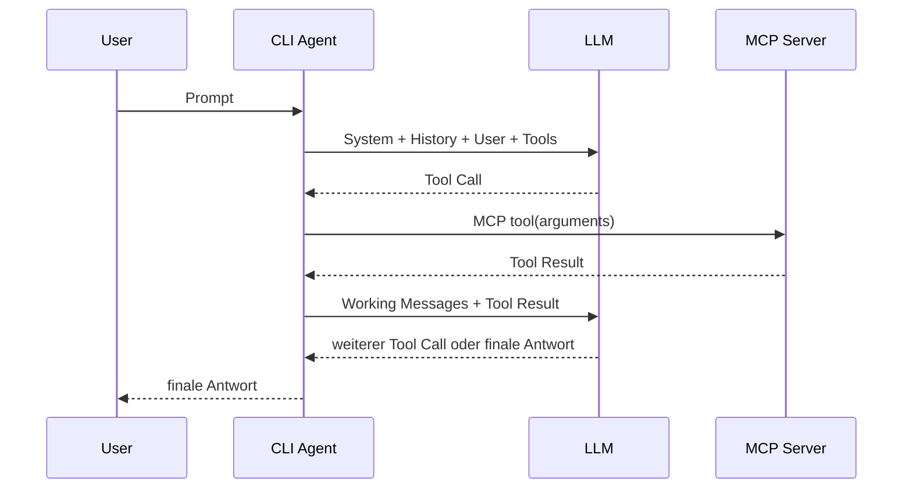

# CLI Agent

## 1. Überblick

`cli-agent` ist ein lokaler Kommandozeilen-Agent für LLM-basierte Aufgaben mit
Conversation History, konfigurierbaren MCP-Servern, optionalem OKF-Retrieval und
explizit ladbarem Web-Kontext. Verfügbare Fähigkeiten werden über Konfiguration
und CLI-Optionen gezielt freigeschaltet; optionale Context Dumps halten die an
das Modell übergebenen Kontexte, Tool-Aufrufe und Retrieval-Ergebnisse fest und
machen damit nachvollziehbar, welche Informationen und Aktionen zu einem
Agentenergebnis geführt haben.

Der Agent verwaltet die Modellnachrichten und den Sitzungszustand, hält
MCP-Verbindungen offen, stellt die jeweils aktiven Tooldefinitionen bereit,
routet Tool-Aufrufe an die zuständigen MCP-Server und führt nach jedem
Tool-Ergebnis den Modelllauf fort.

```text
User -> CLI Agent -> [optional: OKF Retrieval] -> LLM <-> MCP Tools -> Antwort
```

MCP-Fähigkeiten sind standardmäßig deaktiviert. Eine neu angelegte
Standardkonfiguration enthält keine aktiven MCP-Server und kein OKF-Repository.
Damit startet `cli-agent` ohne zusätzliche CLI-Flags zunächst ohne Tools.

## 2. Setup / Installation

### Voraussetzung

Python 3.11 oder neuer muss installiert sein. Unter Windows sollte Python über
`py` oder `python` aufrufbar sein.

Docker wird für den Grundbetrieb nicht benötigt. Es ist nur erforderlich, wenn
der Compose-MCP oder der Python-Validator verwendet werden soll.

### 1. pipx installieren

`cli-agent` wird mit [pipx](https://pipx.pypa.io/) installiert. Unter Windows
kann pipx direkt über die vorhandene Python-Installation eingerichtet werden:

```powershell
py -m pip install pipx
py -m pipx ensurepath
```

Falls `py` nicht verfügbar ist, kann stattdessen `python` verwendet werden:

```powershell
python -m pip install pipx
python -m pipx ensurepath
```

Nach `ensurepath` muss das Terminal gegebenenfalls geschlossen und neu geöffnet
werden, damit die von pipx installierten Programme über `PATH` gefunden werden.

### 2. cli-agent installieren

Im Verzeichnis des ausgecheckten Repositories:

```powershell
py -m pipx install .
```

Falls `py` nicht verfügbar ist:

```powershell
python -m pipx install .
```

Danach steht der Befehl `cli-agent` unabhängig vom aktuellen Verzeichnis zur
Verfügung.

### 3. Standardkonfiguration anlegen

Nach der Installation `cli-agent` einmal starten:

```powershell
cli-agent
```

Beim ersten Start wird automatisch die Standardkonfiguration angelegt. Unter
Windows liegt sie hier:

```text
%LOCALAPPDATA%\cli-agent\config.toml
```

### 4. LLM konfigurieren

Vor der eigentlichen Nutzung muss die erzeugte `config.toml` in einem Texteditor
geöffnet und der Abschnitt `[model]` an den verwendeten LLM-Endpunkt angepasst
werden. Beispielsweise für ein lokales Ollama-Modell:

```toml
[model]
provider = "ollama"
model = "qwen3.5:9b"
base_url = "http://localhost:11434"
timeout = 120
```

Für einen OpenAI-kompatiblen Endpunkt müssen insbesondere `provider`, `model`
und `base_url` angepasst werden. Optional kann `api_key_env` auf den Namen einer
Umgebungsvariable gesetzt werden, die den API-Key enthält. Ist die Variable
nicht gesetzt oder `api_key_env` nicht konfiguriert, verwendet der Agent den
Wert `dummy` als Bearer-Token. Das ist für interne oder lokale
OpenAI-kompatible Endpunkte nützlich, die zwar einen Authorization-Header
erwarten, den Schlüssel aber nicht prüfen.

Weitere Beispiele stehen im Abschnitt [Konfiguration](#3-konfiguration).

Anschließend kann der Agent normal gestartet werden:

```powershell
cli-agent
```

Mit explizitem Workspace:

```powershell
cli-agent --workspace C:\Projekte\mein-projekt
```

Einmalige Anfrage:

```powershell
cli-agent --workspace C:\Projekte\mein-projekt "Welche Services laufen?"
```

### Entwicklung und Tests

Für eine lokale Entwicklungsinstallation mit Testabhängigkeiten kann alternativ
eine virtuelle Umgebung verwendet werden:

```powershell
python -m pip install -e ".[dev]"
pytest
```

## 3. Konfiguration

### Standarddatei

Die Standardkonfiguration liegt unter Windows in:

```text
%LOCALAPPDATA%\cli-agent\config.toml
```

Unter anderen Plattformen wird `XDG_STATE_HOME` beziehungsweise
`~/.cli-agent` verwendet.

Existiert die Standarddatei beim ersten Start noch nicht, kopiert der Agent die
mit dem Paket ausgelieferte sichere Vorlage automatisch an diese Stelle.
Vorhandene Konfigurationen werden dabei nicht überschrieben.

Die Vorlage ist zusätzlich im Repository als
[`config.example.toml`](config.example.toml) verfügbar. Sie enthält bewusst
**keine aktivierten MCP-Server und keine aktivierte OKF-Konfiguration**. Die
mitgelieferten Server sind vollständig auskommentiert enthalten und können bei
Bedarf blockweise aktiviert werden.

Eine andere Konfigurationsdatei kann explizit ausgewählt werden:

```powershell
cli-agent --config C:\Pfad\config.toml
```

Ein nicht vorhandener expliziter `--config`-Pfad wird nicht automatisch
angelegt.

### Modell

Beispiel für Ollama:

```toml
[model]
provider = "ollama"
model = "qwen3.5:9b"
base_url = "http://localhost:11434"
timeout = 120
```

Beispiel für einen OpenAI-kompatiblen Endpunkt:

```toml
[model]
provider = "openai"
model = "NAME-DES-MODELLS"
base_url = "https://llm.example.org/v1"
api_key_env = "LLM_API_KEY"
timeout = 120
```

`api_key_env` ist optional. Wenn die konfigurierte Umgebungsvariable nicht
existiert oder kein `api_key_env` angegeben ist, verwendet der Agent `dummy` als
API-Key.

Der Modellname kann für einen einzelnen Start überschrieben werden:

```powershell
cli-agent --model anderes-modell
```

`--model` ersetzt ausschließlich `model.model`; Provider, Base-URL, Header,
Timeout und die übrige Konfiguration bleiben erhalten.

### MCP-Server

Persistente MCP-Verbindungen werden über `[[mcp_servers]]` konfiguriert.
Unterstützt werden `stdio` und Streamable HTTP.

Beispiel für einen externen `stdio`-Server:

```toml
[[mcp_servers]]
name = "example"
transport = "stdio"
command = "{python}"
args = ["-m", "example_mcp", "--root", "{workspace_directory}"]
```

Beispiel für Streamable HTTP:

```toml
[[mcp_servers]]
name = "external"
transport = "streamable_http"
url = "http://127.0.0.1:8001/mcp"

[mcp_servers.headers]
Authorization = "Bearer example-token"
```

Für `stdio`-Server stehen folgende Platzhalter zur Verfügung:

- `{python}`: aktuell laufender Python-Interpreter
- `{workspace_directory}`: beim Agentenstart festgelegter Workspace
- `{project_directory}`: Alias für `{workspace_directory}`
- `{config_file}`: tatsächlich verwendete Konfigurationsdatei

Zwei mitgelieferte Server können für einen einzelnen Agentenstart ohne
persistente Konfigurationsänderung zugeschaltet werden:

```powershell
cli-agent --with-os-read
cli-agent --with-os-write
cli-agent --with-python-validator
```

Die CLI-Varianten ersetzen einen eventuell gleichnamigen Server aus der
Konfigurationsdatei durch die eingebaute Definition. Die ausgewählte globale
Konfigurationsdatei wird an den gestarteten MCP-Prozess weitergegeben.

Ohne `[[mcp_servers]]` und ohne diese CLI-Flags werden in der Main-Phase keine
MCP-Tools bereitgestellt. Insbesondere erhält ein ohne weitere Parameter aus
einer Taskleiste oder einem Terminal gestarteter Agent dadurch keinen
Dateisystemzugriff über den Workspace-OS-MCP.

### OKF-Knowledge-Phase

Die optionale OKF-Integration wird separat konfiguriert:

```toml
[okf]
repository = "C:/dev/knowledge/okf/bundle"
max_tool_calls = 200
max_read_bytes = 2560000
compress_min_chars = 20000
required = true
```

Sie ist in der ausgelieferten Standardkonfiguration deaktiviert. Technische
Details stehen unter [docs/mcp-okf.md](docs/mcp-okf.md).

### Logging und Context Dumps

```toml
[logging]
enabled = true
level = "INFO"
log_prompts = true
log_model_messages = false
log_tool_results = false
max_bytes = 5000000
backup_count = 3
```

Mit

```toml
dump_llm_context = true
```

schreibt der Agent zusätzliche Diagnoseinformationen unter
`<workspace>/.cli-agent/`.

## 4. Mitgelieferte MCP-Server

| MCP-Server | Zweck | Aktivierung | Dokumentation |
| --- | --- | --- | --- |
| Docker Compose | Compose-Datei, Service-Status, Logs und optional Service-Steuerung | `[[mcp_servers]]` | [Compose MCP](docs/mcp-compose.md) |
| Workspace OS | Workspace-relative Dateioperationen, optional mit Schreibzugriff | `[[mcp_servers]]`, `--with-os-read`, `--with-os-write` | [Workspace OS MCP](docs/mcp-os.md) |
| Python Validator | Python-Projekte in einem kurzlebigen Docker-Container installieren und starten | `[[mcp_servers]]`, `--with-python-validator` | [Python Validator MCP](docs/mcp-python-validator.md) |
| OKF | Read-only Retrieval aus einem Open-Knowledge-Format-Repository | `[okf]` | [OKF MCP](docs/mcp-okf.md) |

Die Server sind in `config.example.toml` als auskommentierte Konfigurationsblöcke
enthalten. Zusätzliche externe MCP-Server können unabhängig davon über `stdio`
oder Streamable HTTP angebunden werden.

Während einer interaktiven Sitzung können bereits verbundene normale MCP-Server
für folgende Modellaufrufe deaktiviert beziehungsweise erneut aktiviert werden:

```text
disable compose
enable compose
```

Dabei bleibt die MCP-Verbindung bestehen. Nur die Tools und `instructions` des
Servers werden aus dem aktiven Modellkontext entfernt beziehungsweise wieder
hinzugefügt.

## 5. Technischer Ablauf des Agenten

### Session und Conversation History

`CliAgent.history` enthält die abgeschlossenen User-/Assistant-Turns der
aktuellen Sitzung. Für jeden neuen Prompt wird daraus ein separater
`working_messages`-Kontext erzeugt.

```text
System-Prompt
+ Conversation History
+ aktuelle User-Nachricht
+ optionaler OKF-Kontext
+ optionaler Web-Kontext
```

Tool-Aufrufe und Tool-Ergebnisse eines laufenden Turns werden nur in
`working_messages` ergänzt. Nach einer finalen Modellantwort werden die
ursprüngliche User-Nachricht und die Endantwort in `history` übernommen; die
Tool-Zwischenschritte werden nicht in die persistierte Conversation History
kopiert.

### System-Prompt und Tooldefinitionen

Der Main-System-Prompt wird für jeden Turn neu aufgebaut. Er enthält unter
anderem den festgelegten Workspace, das aktuelle Datum, die Namen der aktuell
verfügbaren Tools sowie `instructions` der aktiven MCP-Server.

Die vollständigen Toolschemas werden nicht als Text in den System-Prompt
kopiert. Sie werden separat über die Tool-/Function-Schnittstelle des
Model-Clients übertragen.

MCP-`instructions` werden als serverbezogene Hinweise eingebunden. Sie dürfen
die zentralen Agentenregeln, Benutzeranweisungen und Berechtigungsgrenzen nicht
überschreiben.

### MCP-Verbindungen und Modell-Tool-Loop

Beim Start öffnet der Agent für jeden konfigurierten normalen MCP-Server eine
Session und ruft `initialize` sowie `list_tools` auf. Die Verbindung bleibt für
die gesamte Agentensitzung bestehen.

Toolnamen werden gegenüber dem Modell als `<server>__<tool>` exponiert. Damit
bleiben gleichnamige Tools unterschiedlicher Server eindeutig routbar.



Bei einem Tool-Aufruf prüft der Agent den exponierten Toolnamen und den Status
des zugehörigen Servers, führt den MCP-Aufruf aus und fügt das Ergebnis als
`role: tool` in den aktuellen Arbeitskontext ein. Danach wird das Modell erneut
mit dem erweiterten Kontext aufgerufen. Dieser Ablauf wiederholt sich bis zu
einer finalen Textantwort oder bis ein konfiguriertes Tool-Call-Limit erreicht
ist.

### Separate OKF-Retrieval-Phase

Wenn `[okf]` konfiguriert ist, wird vor dem Main-Agentenlauf ein separater
Retrieval-Kontext aufgebaut. Dieser verwendet einen eigenen System-Prompt und
sieht ausschließlich die read-only Tools `knowledge_index` und
`knowledge_read` des internen OKF-MCP-Servers.

Der Agent lädt den Root-Index, begrenzt die Navigation auf tatsächlich vom
Repository angebotene Pfade und validiert die finale Concept-Auswahl über
agentenseitig vergebene Selection-Tokens. Nur die ausgewählten, vollständig
gelesenen Concepts werden anschließend als Referenzkontext in die Main-Phase
übernommen.

Details zu Limits, Navigation und Auswahlvalidierung stehen in
[docs/mcp-okf.md](docs/mcp-okf.md).

### Web-Kontext

Im interaktiven Modus können Webseiten explizit als Session-Kontext geladen
werden:

```text
add_web_context https://example.org/docs
clear_web_context
```

Der Agent lädt ausschließlich die angegebene `http`- oder `https`-URL. Bei
HTML-Seiten extrahiert Trafilatura den relevanten Hauptinhalt und reduziert
dabei typischen Boilerplate-Inhalt wie Navigation, Footer oder Seitenteaser.
Geladene Web-Kontexte werden separat von `history` gehalten und bei jedem
folgenden normalen Turn erneut in die aktuelle User-Nachricht des
Arbeitskontexts eingebaut.

`clear_web_context` entfernt alle Web-Kontexte aus dem Session-State. Inhalte
geladener Webseiten gelten als nicht vertrauenswürdige Referenzdaten und dürfen
keine zusätzlichen Netzwerkzugriffe auslösen. `localhost` und private
Netzwerkadressen sind für den expliziten `add_web_context`-Befehl zulässig.

### Context Dumps

Mit `dump_llm_context = true` werden unter `<workspace>/.cli-agent/` unter
anderem folgende Dateien geschrieben:

- `history.json`
- `main_system_prompt.json`
- `main_working_messages.json`
- `knowledge_system_prompt.json`
- `knowledge_working_messages.json`
- `knowledge_selection.json`
- `knowledge_result.json`

Die Dumps bilden die vom Agenten erzeugten Nachrichtenkontexte und die Übergabe
zwischen Retrieval- und Main-Phase ab.