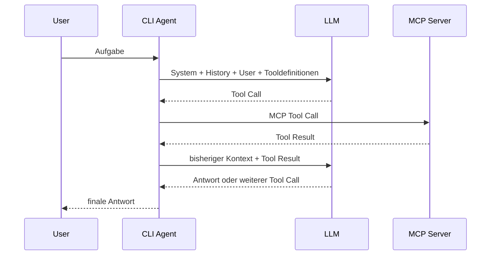

# CLI Agent

## 1. Überblick

`cli-agent` ist ein lokaler Kommandozeilen-Agent, der ein Large Language Model
mit Gesprächskontext und MCP-Tools verbindet. Optional kann vor der eigentlichen
Bearbeitung eine separate OKF-Knowledge-Phase ausgeführt werden; Webseiten
können explizit als zusätzlicher Session-Kontext geladen werden.

Der Agent ist bewusst generisch: Er ist weder auf Docker Compose noch auf einen
bestimmten Modellanbieter festgelegt. MCP-Server liefern Fähigkeiten, während
der Agent den Modellkontext, die Tool-Aufrufe und den Sitzungszustand
orchestriert.

```text
User -> CLI Agent -> [optional: OKF Retrieval] -> LLM <-> MCP Tools -> Antwort
```

## 2. Setup / Installation

### Voraussetzungen

- Python 3.11 oder neuer
- ein unterstützter Modellendpunkt:
  - Ollama oder
  - OpenAI-kompatible Chat-Completions-API
- ein Modell mit Tool-Calling-Unterstützung, wenn MCP-Tools verwendet werden
- Docker nur für die mitgelieferten Compose- und Python-Validator-Werkzeuge

### Installation

Im Projektverzeichnis:

```powershell
pipx install --editable .
```

Alternativ in einer virtuellen Umgebung:

```powershell
python -m pip install -e .
```

Für Entwicklung und Tests:

```powershell
python -m pip install -e ".[dev]"
pytest
```

Der Benutzerbefehl lautet:

```text
cli-agent
```

Interaktiv im aktuellen Verzeichnis:

```powershell
cli-agent
```

Mit festem Workspace:

```powershell
cli-agent --workspace C:\Projekte\mein-projekt
```

Einmalige Anfrage:

```powershell
cli-agent --workspace C:\Projekte\mein-projekt "Welche Services laufen?"
```

## 3. Konfiguration

Die Standardkonfiguration liegt unter Windows in:

```text
%LOCALAPPDATA%\cli-agent\config.toml
```

Unter anderen Plattformen wird `XDG_STATE_HOME` beziehungsweise
`~/.cli-agent` verwendet. Eine andere Datei kann mit `--config` gewählt werden:

```powershell
cli-agent --config C:\Pfad\config.toml
```

### Modell

Lokales Ollama:

```toml
[model]
provider = "ollama"
model = "qwen3.5:9b"
base_url = "http://localhost:11434"
timeout = 120
```

OpenAI-kompatibler Endpunkt:

```toml
[model]
provider = "openai"
model = "NAME-DES-MODELLS"
base_url = "https://llm.example.org/v1"
api_key_env = "LLM_API_KEY"
timeout = 120
```

Der Modellname kann für einen einzelnen Start überschrieben werden, ohne die
restliche Modellkonfiguration zu verändern:

```powershell
cli-agent --model anderes-modell
```

### MCP-Server

Normale MCP-Server werden über `[[mcp_servers]]` konfiguriert. Unterstützt
werden `stdio` und Streamable HTTP.

Beispiel für `stdio`:

```toml
[[mcp_servers]]
name = "example"
transport = "stdio"
command = "{python}"
args = ["-m", "example_mcp", "--root", "{workspace_directory}"]
```

Beispiel für Streamable HTTP:

```toml
[[mcp_servers]]
name = "external"
transport = "streamable_http"
url = "http://127.0.0.1:8001/mcp"

[mcp_servers.headers]
Authorization = "Bearer example-token"
```

Verfügbare Platzhalter für `stdio`-Konfigurationen:

- `{python}`: aktuell laufender Python-Interpreter
- `{workspace_directory}`: beim Agentenstart gewählter Workspace
- `{project_directory}`: Alias für `{workspace_directory}`
- `{config_file}`: tatsächlich verwendete Konfigurationsdatei

Einige mitgelieferte MCP-Server können direkt per CLI zugeschaltet werden:

```powershell
cli-agent --with-os-read
cli-agent --with-os-write
cli-agent --with-python-validator
```

Diese Flags ersetzen einen gleichnamigen MCP-Server aus der Datei durch die
vordefinierte eingebaute Konfiguration. Die ausgewählte globale
Konfigurationsdatei wird dabei weiterhin an den gestarteten MCP-Prozess
weitergegeben.

### OKF-Knowledge-Phase

Die OKF-Integration wird separat konfiguriert:

```toml
[okf]
repository = "C:/dev/knowledge/okf/bundle"
max_tool_calls = 200
max_read_bytes = 2560000
compress_min_chars = 20000
required = true
```

Der OKF-Server ist kein normales Main-Phase-Tool. Details stehen unter
[docs/mcp-okf.md](docs/mcp-okf.md).

### Logging und Context Dumps

```toml
[logging]
enabled = true
level = "INFO"
log_prompts = true
log_model_messages = false
log_tool_results = false
max_bytes = 5000000
backup_count = 3
```

Für Debugging kann zusätzlich der vollständige Modellkontext in
`<workspace>/.cli-agent/` geschrieben werden:

```toml
dump_llm_context = true
```

Eine ausführlichere Beispielkonfiguration liegt in `config.example.toml`.

## 4. Mitgelieferte MCP-Server

| MCP-Server | Zweck | Aktivierung | Dokumentation |
| --- | --- | --- | --- |
| Docker Compose | Compose-Datei, Status, Logs und optional Service-Steuerung | `[[mcp_servers]]` | [Compose MCP](docs/mcp-compose.md) |
| Workspace OS | Dateien im Workspace lesen und optional verändern | `[[mcp_servers]]`, `--with-os-read`, `--with-os-write` | [Workspace OS MCP](docs/mcp-os.md) |
| Python Validator | Python-Projekte isoliert in einem kurzlebigen Docker-Container starten und validieren | `[[mcp_servers]]`, `--with-python-validator` | [Python Validator MCP](docs/mcp-python-validator.md) |
| OKF | Read-only Retrieval aus einem Open-Knowledge-Format-Repository | `[okf]` | [OKF MCP](docs/mcp-okf.md) |

Zusätzlich können beliebige externe MCP-Server über `stdio` oder Streamable HTTP
angebunden werden.

Während einer interaktiven Sitzung lassen sich normale MCP-Server aus dem
Modellkontext aus- und wieder einblenden:

```text
disable compose
enable compose
```

Die MCP-Verbindung bleibt dabei bestehen; nur Tools und `instructions` des
Servers werden für folgende Modellaufrufe deaktiviert beziehungsweise wieder
aktiviert.

## 5. Was der Agent technisch tut

Der entscheidende Punkt der Architektur ist: **Das LLM ist nicht der Agent.**
Das Modell erzeugt Text oder strukturierte Tool-Aufrufe. Der Agent hält Zustand,
verwaltet MCP-Verbindungen, baut den Modellkontext, führt Tools aus und sendet
deren Ergebnisse wieder an das Modell.

### Conversation History und Working Context

`CliAgent.history` speichert nur abgeschlossene Gesprächsschritte:

```text
User-Nachricht
Assistant-Endantwort
User-Nachricht
Assistant-Endantwort
...
```

Für jeden neuen Turn baut der Agent daraus einen separaten Arbeitskontext:

```text
System-Prompt
+ Conversation History
+ aktuelle User-Nachricht
+ optionaler OKF-Kontext
+ optionaler Web-Kontext
```

Tool-Aufrufe und Tool-Ergebnisse eines laufenden Turns werden nur in diesem
`working_messages`-Kontext gehalten. Erst die finale Antwort wird zusammen mit
der ursprünglichen User-Nachricht dauerhaft in die Conversation History
übernommen.

### MCP-Verbindungen und Tool-Loop

Beim Start verbindet sich der Agent einmal mit allen konfigurierten normalen
MCP-Servern und lädt deren Tools. Gegenüber dem Modell werden Toolnamen als
`<server>__<tool>` exponiert, damit gleichnamige Tools verschiedener Server
eindeutig bleiben.



Ein Tool wird also nicht vom LLM selbst ausgeführt. Der Agent validiert und
routet den Aufruf, führt ihn über die bestehende MCP-Session aus und ergänzt das
Ergebnis als `role: tool`. Dieser Loop läuft, bis das Modell eine finale Antwort
erzeugt oder ein konfiguriertes Limit erreicht wird.

`instructions` eines MCP-Servers werden in den System-Prompt aufgenommen, dürfen
aber zentrale Agentenregeln, Benutzeranweisungen oder Berechtigungsgrenzen nicht
überschreiben.

### Separate OKF-Knowledge-Phase

Wenn `[okf]` konfiguriert ist, läuft vor der Main-Phase ein eigener
Retrieval-Schritt. Das Retrieval-Modell sieht ausschließlich die beiden
read-only OKF-Tools `knowledge_index` und `knowledge_read`. Der Agent beschränkt
die Navigation auf tatsächlich angebotene Links und validiert die finale
Concept-Auswahl. Nur die ausgewählten Originalinhalte werden anschließend als
nicht vertrauenswürdiger Referenzkontext an die Main-Phase übergeben.

Die Trennung verhindert, dass fachliche Wissensbeschaffung und ausführende
MCP-Tools im selben Retrieval-Schritt vermischt werden. Weitere Details stehen
unter [docs/mcp-okf.md](docs/mcp-okf.md).

### Web-Kontext

Im interaktiven Modus kann eine Webseite explizit als Session-Kontext geladen
werden:

```text
add_web_context https://example.org/docs
clear_web_context
```

Der Agent lädt die angegebene `http`- oder `https`-URL, extrahiert mit
BeautifulSoup den Text und hält ihn separat von der Conversation History. Der
aktuelle Web-Kontext wird bei jedem folgenden Turn erneut in den Arbeitskontext
eingebaut. `clear_web_context` entfernt alle geladenen Web-Kontexte für folgende
Turns.

Web-Inhalte werden als nicht vertrauenswürdige Referenzdaten behandelt. Darin
enthaltene Anweisungen dürfen keine weiteren Netzwerkzugriffe auslösen oder
System- beziehungsweise Benutzerregeln überschreiben. `localhost` und private
Netzwerkadressen sind bei einem expliziten `add_web_context` bewusst erlaubt.

### Context Dumps

Mit `dump_llm_context = true` schreibt der Agent unter
`<workspace>/.cli-agent/` unter anderem:

- `history.json`
- `main_system_prompt.json`
- `main_working_messages.json`
- `knowledge_system_prompt.json`
- `knowledge_working_messages.json`
- `knowledge_selection.json`
- `knowledge_result.json`

Damit lässt sich nachvollziehen, welche Nachrichten und Referenzdaten das Modell
in den einzelnen Phasen tatsächlich erhalten hat.
