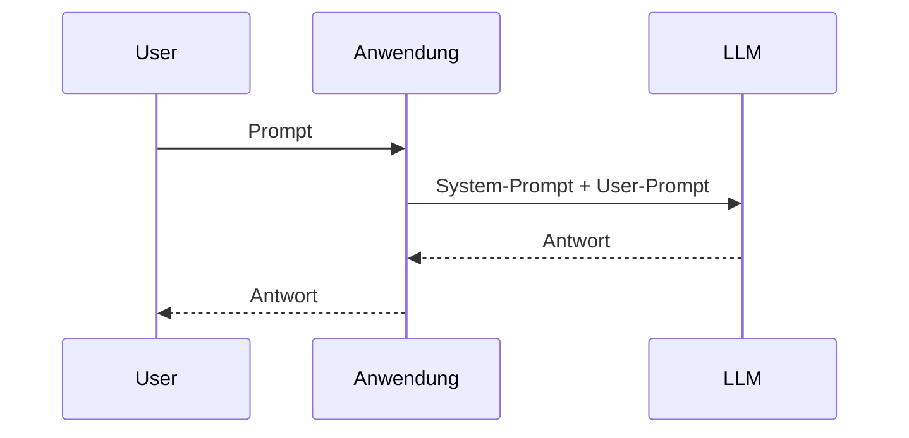
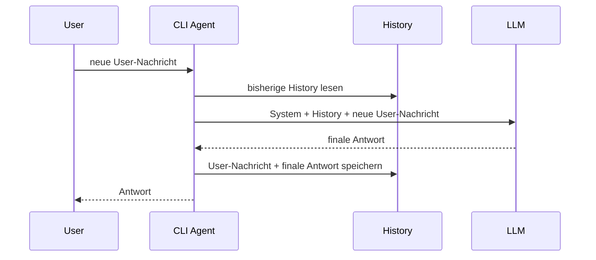
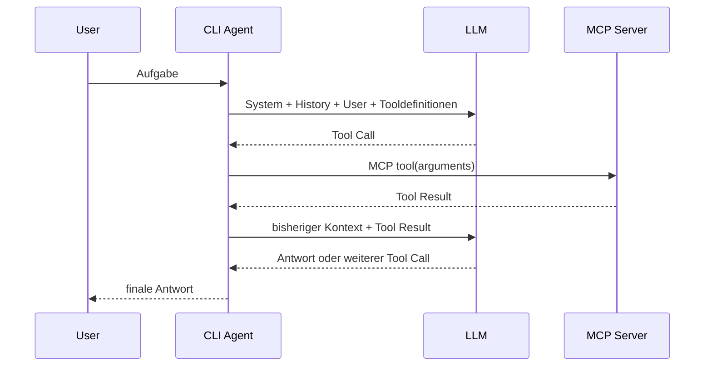
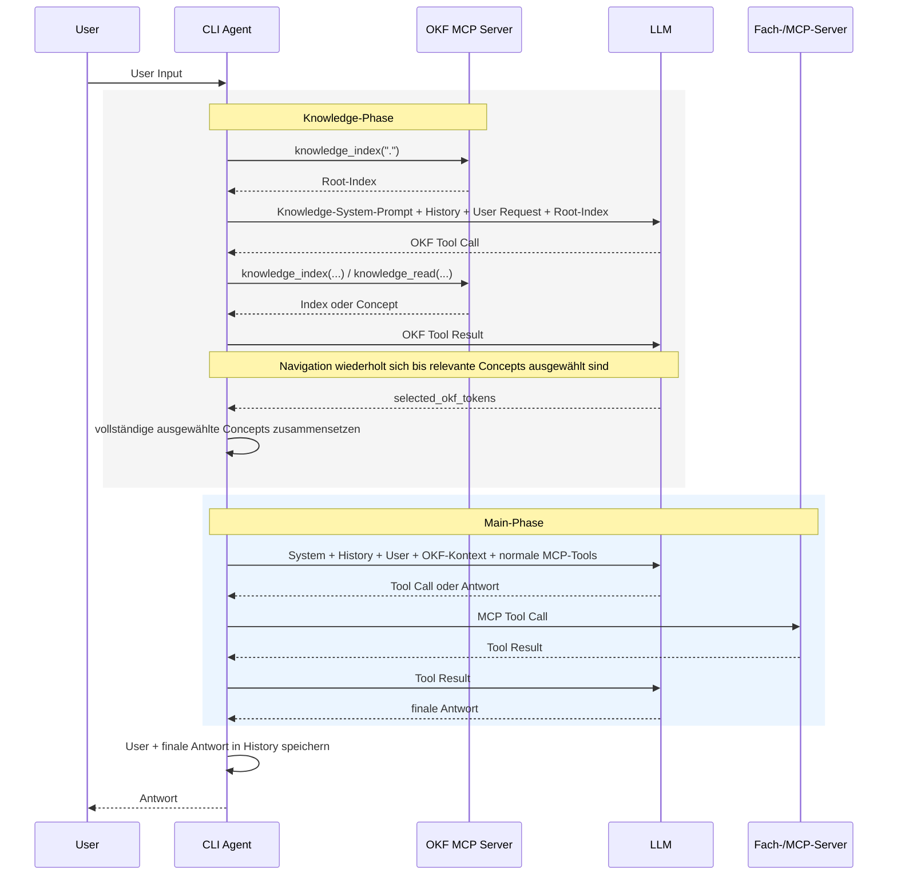
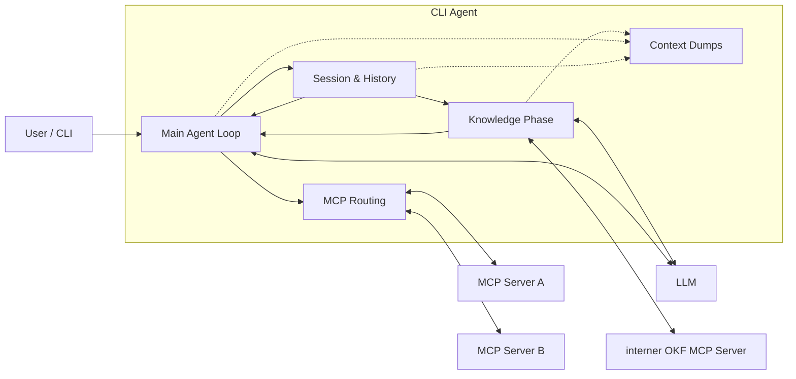

# CLI Agent

`cli-agent` ist ein lokaler Kommandozeilen-Agent, der ein Large Language Model
(LLM) mit Gesprächskontext, optionalem OKF-Wissen und Werkzeugen aus
konfigurierbaren MCP-Servern verbindet.

Das Projekt ist bewusst klein gehalten: Die Agentenlogik liegt sichtbar im
Client. Dadurch lässt sich nachvollziehen, welche Nachrichten an das Modell
gesendet werden, wie Tool-Aufrufe entstehen und wie Tool-Ergebnisse wieder in
den Modellkontext gelangen.

Der mitgelieferte Docker-Compose-MCP-Server ist nur eine mögliche Werkzeugquelle.
Die Agentenlogik selbst ist nicht auf Docker oder Compose festgelegt.

## Architektur in einem Satz

```text
User -> CLI Agent -> [optionale OKF-Knowledge-Phase] -> LLM <-> MCP-Tools -> Antwort
```

Der entscheidende Punkt ist: **Das LLM ist nicht der Agent.** Das Modell bekommt
Nachrichten und Tooldefinitionen und erzeugt daraus Text oder Tool-Aufrufe. Der
Agent hält Zustand, baut den Kontext, führt Tools aus und entscheidet, welche
Informationen beim nächsten Modellaufruf wieder mitgesendet werden.

## Vom LLM zum Agenten

Die folgenden Diagramme bauen die Architektur schrittweise auf. Sie eignen sich
auch dazu, den Ablauf in einer Präsentation von einem einfachen LLM-Aufruf bis
zum vollständigen Agenten mit OKF und MCP zu erklären.

### 1. Einfacher LLM-Aufruf: noch kein Agentengedächtnis



Aus Sicht dieser Anwendung ist ein Modellaufruf stateless: Beim nächsten
Request kennt das Modell den vorherigen Request nicht automatisch. Soll ein
Gespräch fortgesetzt werden, muss die Anwendung den bisherigen Kontext erneut
mitsenden.

### 2. Agent mit Conversation History



`CliAgent.history` enthält die bisherigen User-Nachrichten und die jeweils
finalen Assistant-Antworten. Für jeden neuen Turn wird daraus ein neuer
`working_messages`-Kontext aufgebaut.

Wichtig: Tool-Zwischenschritte eines Turns werden nicht dauerhaft in
`history` übernommen. Sie existieren während des aktuellen Agentenlaufs in
`working_messages`; für spätere Turns bleiben nur die ursprüngliche
User-Nachricht und die finale Antwort erhalten.

### 3. Agent mit MCP-Tools



Das Modell führt kein MCP-Tool selbst aus. Es erzeugt lediglich einen
strukturierten Tool-Aufruf. Der Agent validiert den Aufruf, routet ihn zum
passenden MCP-Server, führt ihn aus und fügt das Ergebnis als Nachricht mit
`role: tool` in den laufenden Modellkontext ein. Danach wird das LLM erneut
aufgerufen.

Dieser Loop läuft so lange, bis das Modell statt eines Tool-Aufrufs eine finale
Antwort erzeugt oder ein konfiguriertes Limit erreicht wird.

### 4. Vollständiger Ablauf mit OKF-Knowledge-Phase und MCP



Die Knowledge-Phase ist bewusst vom eigentlichen Arbeitslauf getrennt. Sie darf
nur Wissen aus dem OKF-Repository ermitteln; Aktionen werden erst in der
Main-Phase ausgeführt.

## Komponenten



### `CliAgent`

`CliAgent` ist die zentrale Orchestrierungsschicht. Er

- hält die Conversation History,
- verbindet MCP-Server und hält ihre Sessions offen,
- baut System-Prompts und Modellnachrichten,
- stellt dem Modell Tooldefinitionen bereit,
- verarbeitet Tool-Calls in einem Agentenloop,
- führt optional vor jedem normalen Turn die OKF-Knowledge-Phase aus und
- kann den vollständigen Modellkontext zu Debug- und Demonstrationszwecken
  dumpen.

### Model Client

Der Agent hängt nur von der kleinen `ModelClient`-Abstraktion ab. Aktuell gibt
es Clients für

- Ollama und
- OpenAI-kompatible Chat-Completions-Endpunkte.

Damit kann dieselbe Agentenlogik sowohl mit einem lokalen Modell als auch mit
einem zentral bereitgestellten Unternehmensmodell verwendet werden.

### Normale MCP-Server

Beim Start verbindet sich der Agent einmal mit allen konfigurierten MCP-Servern.
Unterstützt werden

- `stdio` und
- Streamable HTTP.

Nach `initialize` lädt der Agent die verfügbaren Tools. Gegenüber dem Modell
werden sie als `<server>__<tool>` exponiert, beispielsweise
`compose__compose_ps`. Dadurch bleiben gleichnamige Tools verschiedener Server
eindeutig routbar.

`instructions` aus dem MCP-`initialize`-Ergebnis werden unter dem jeweiligen
Servernamen in den System-Prompt aufgenommen. Zentrale Agentenregeln bleiben
vorrangig.

Ein Server kann während einer interaktiven Sitzung mit `disable <name>` für das
Modell ausgeblendet und mit `enable <name>` wieder aktiviert werden. Die
MCP-Verbindung selbst bleibt dabei bestehen.

### Interner OKF-MCP-Server

Wenn `[okf]` konfiguriert ist, startet der Agent zusätzlich einen eigenen,
read-only OKF-MCP-Server. Dieser ist **nicht** Teil des normalen Toolsets der
Main-Phase.

Der interne Server muss exakt zwei Tools anbieten:

- `knowledge_index`
- `knowledge_read`

Damit ist die Wissensbeschaffung technisch und promptseitig von den späteren
Aktions-Tools getrennt.

## Die Knowledge-Phase im Detail

Die Knowledge-Phase wird vor der eigentlichen Bearbeitung eines User-Prompts
ausgeführt.

### 1. Root-Index wird vom Agenten geladen

Der Agent ruft zuerst selbst

```text
knowledge_index(".")
```

auf. Das Ergebnis wird als `root_index` zusammen mit der ursprünglichen
User-Anfrage in einen separaten Retrieval-Kontext eingebaut.

Der Root-Index ist nur Navigation. Er wird nicht als eigentliche fachliche
Quelle ausgewählt.

### 2. Separater Modellkontext

Für die Retrieval-Phase erzeugt der Agent einen eigenen Kontext aus

```text
Knowledge-System-Prompt
+ bisheriger Conversation History
+ original_user_request
+ root_index
+ aktuellem Selection-State
```

Das Modell sieht in dieser Phase ausschließlich die beiden OKF-Tools. Normale
MCP-Tools stehen nicht zur Verfügung.

### 3. Modellgesteuerte Navigation, agentenseitig begrenzt

Das Modell entscheidet, welchem Link aus dem OKF-Index es folgen möchte. Der
Agent erzwingt dabei zusätzliche Regeln:

- pro Modellantwort ist genau ein OKF-Tool-Aufruf zulässig,
- identische erfolgreiche Aufrufe werden nicht erneut ausgeführt,
- ein Pfad darf nur verwendet werden, wenn er vorher vom Root-Index oder einem
  `internal_links`-Ergebnis angeboten wurde,
- `not_found` ist erst zulässig, nachdem mindestens ein Concept gelesen wurde,
- Tool- und Concept-Limits begrenzen den Retrieval-Lauf.

Damit ist die Navigation weiterhin LLM-gesteuert, aber nicht beliebig.

### 4. Concepts erhalten Agent-Tokens

Nach einem erfolgreichen `knowledge_read` eines Concept-Dokuments registriert
der Agent das Dokument intern und vergibt dafür einen zufälligen
Selection-Token.

Das Retrieval-Modell darf am Ende nur solche bereits vergebenen Tokens in
`selected_okf_tokens` zurückgeben. Repository-Pfade oder `concept_id`-Werte
sind keine gültige Auswahl.

Das verhindert, dass die finale Auswahl auf nicht gelesene oder erfundene
Concepts verweist.

### 5. Auswahl wird validiert

Die finale Retrieval-Antwort ist ein JSON-Objekt. Der Agent prüft unter anderem,
ob

- `found_content` korrekt gesetzt ist,
- bei `found_content: true` mindestens ein gültiger Selection-Token vorhanden
  ist und
- `not_applicable` beziehungsweise `not_found` zum bisherigen Retrieval-Verlauf
  passen.

Ungültige Ausgaben werden korrigierend an das Modell zurückgespielt. Nach
wiederholt ungültigen Antworten existiert ein agentenseitiger Fallback auf die
bereits tatsächlich gelesenen Concepts.

### 6. Nur ausgewählte Originalinhalte gehen in die Main-Phase

Aus den ausgewählten Tokens erzeugt der Agent einen Payload mit dem
vollständigen Inhalt der ausgewählten Concept-Dokumente:

```json
{
  "found_content": true,
  "content": [
    {
      "concept": "...",
      "content_type": "full",
      "content": "..."
    }
  ],
  "warnings": []
}
```

Dieser Payload wird zusammen mit der ursprünglichen User-Anfrage in die
Main-Phase übernommen. OKF-Inhalte werden dort explizit als nicht
vertrauenswürdige Referenzdaten behandelt; enthaltene Anweisungen dürfen keine
System- oder Benutzerregeln überschreiben.

Wenn die Knowledge-Phase keinen anwendbaren oder hilfreichen Inhalt findet,
bekommt die Main-Phase einfach die ursprüngliche User-Anfrage ohne zusätzlichen
OKF-Kontext.

## Main Agent Loop

Der normale Agentenlauf beginnt mit

```text
System-Prompt
+ Conversation History
+ aktuelle User-Nachricht
+ optional ausgewähltem OKF-Kontext
```

Zusätzlich werden die aktuell aktiven MCP-Tooldefinitionen separat an den
Model-Client übergeben.

Wenn das Modell einen Tool-Call erzeugt:

1. prüft der Agent, ob das Tool existiert und der zugehörige Server aktiv ist,
2. führt er den MCP-Aufruf aus,
3. fügt das Ergebnis als `role: tool` in `working_messages` ein und
4. ruft das Modell mit dem erweiterten Kontext erneut auf.

Wenn das Modell eine Textantwort ohne Tool-Call erzeugt, ist der Turn beendet.
Erst dann werden die ursprüngliche User-Nachricht und die finale Antwort in die
Conversation History aufgenommen.

## Kontext-Dumps: sehen, was das LLM wirklich bekommt

Für Debugging und zum Verständnis des Agenten kann der komplette Modellkontext
im Workspace ausgegeben werden. Dazu in der Konfiguration auf Top-Level setzen:

```toml
dump_llm_context = true
```

Die Dateien werden unter

```text
<workspace>/.cli-agent/
```

geschrieben. Besonders hilfreich sind:

| Datei | Inhalt |
| --- | --- |
| `history.json` | persistierte Conversation History |
| `main_system_prompt.json` | aktueller System-Prompt der Main-Phase |
| `main_working_messages.json` | vollständiger laufender Main-Kontext inkl. Tool-Calls und Tool-Resultaten |
| `knowledge_system_prompt.json` | separater Retrieval-System-Prompt |
| `knowledge_working_messages.json` | vollständiger Kontext der Knowledge-Phase |
| `knowledge_last_model_message.json` | letzte Modellantwort der Knowledge-Phase |
| `knowledge_selection.json` | finale Auswahl des Retrieval-Modells |
| `knowledge_result.json` | tatsächlich an die Main-Phase übernommener OKF-Payload bzw. Fehlerstatus |
| `knowledge_selection_fallback.json` | nur bei einem Retrieval-Fallback |

Gerade `*_working_messages.json` macht sichtbar, dass History, Tool-Calls und
Tool-Ergebnisse keine interne Magie des LLM sind, sondern vom Agenten explizit
als Nachrichten aufgebaut und erneut an das Modell geschickt werden.

## Mitgelieferter Compose-MCP-Server

Der Compose-Server wird auf ein Projektverzeichnis festgelegt und bietet:

- `get_compose_file`
- `compose_ps`
- `compose_logs`
- `compose_up_all`
- `compose_start`
- `compose_stop`
- `compose_restart`

Servicenamen werden vor Aktionen mit `docker compose config --services`
validiert. Docker wird ohne Shell über eine feste Argumentliste aufgerufen.
`compose_start` verwendet `docker compose up -d <service>`, sodass der Service
bei Bedarf auch erstellt wird. `compose_stop` entfernt den Container nicht.

## Voraussetzungen

- Python 3.11 oder neuer
- ein unterstützter Modellendpunkt
  - Ollama oder
  - OpenAI-kompatible Chat-Completions-API
- ein Modell mit Tool-Calling-Unterstützung, falls MCP-Tools genutzt werden
- für die Compose-Werkzeuge: Docker mit `docker compose`

## Installation

Im Projektverzeichnis:

```powershell
pipx install --editable .
```

Oder in einer virtuellen Umgebung:

```powershell
python -m pip install -e .
```

Der Benutzerbefehl heißt:

```text
cli-agent
```

Der zusätzliche Einstiegspunkt `cli-agent-compose-mcp` kann zum Debuggen des
mitgelieferten Compose-Servers direkt verwendet werden. Normalerweise startet
ihn der Agent als `stdio`-Unterprozess.

## Konfiguration

Die Standarddatei liegt unter Windows in:

```text
%LOCALAPPDATA%\cli-agent\config.toml
```

Unter anderen Plattformen wird `XDG_STATE_HOME` beziehungsweise
`~/.cli-agent` verwendet.

### Modell

Lokales Ollama:

```toml
[model]
provider = "ollama"
model = "qwen3.5:9b"
base_url = "http://localhost:11434"
timeout = 120
```

OpenAI-kompatibler Endpunkt:

```toml
[model]
provider = "openai"
model = "NAME-DES-MODELLS"
base_url = "https://llm.example.org/v1"
api_key_env = "LLM_API_KEY"
timeout = 120
```

### MCP-Server über `stdio`

Ohne `[[mcp_servers]]`-Einträge ist der Agent weiterhin verwendbar, besitzt in
der Main-Phase aber keine Tools.

```toml
[[mcp_servers]]
name = "compose"
transport = "stdio"
command = "{python}"
args = [
    "-m",
    "cli_agent.mcp_server",
    "--project-directory",
    "{workspace_directory}",
    "--config-file",
    "{config_file}",
]
```

Unterstützte Platzhalter:

- `{python}`: aktuell laufender Python-Interpreter
- `{workspace_directory}`: festgelegter Workspace
- `{config_file}`: verwendete Konfigurationsdatei
- `{project_directory}`: älterer Alias für `{workspace_directory}`

Ein externer `stdio`-Server kann aus einer eigenen Umgebung gestartet werden:

```toml
[[mcp_servers]]
name = "documents"
transport = "stdio"
command = "C:/Projekte/documents-mcp/.venv/Scripts/python.exe"
args = ["-m", "documents_mcp", "--root", "{workspace_directory}"]

[mcp_servers.env]
EXAMPLE_API_URL = "http://localhost:8080"
```

### MCP über Streamable HTTP

```toml
[[mcp_servers]]
name = "external"
transport = "streamable_http"
url = "http://127.0.0.1:8001/mcp"

[mcp_servers.headers]
Authorization = "Bearer example-token"
```

### OKF-Repository

```toml
[okf]
repository = "C:/dev/knowledge/okf/bundle"
max_tool_calls = 200
max_read_bytes = 2560000
compress_min_chars = 20000
required = true
```

Mit `required = true` bricht die Bearbeitung ab, wenn die konfigurierte
Knowledge-Phase nicht verfügbar ist oder fehlschlägt. Mit `required = false`
kann die Main-Phase ohne OKF-Kontext fortgesetzt werden.

## Verwendung

Interaktiv im aktuellen Ordner:

```powershell
cli-agent
```

Anderer Arbeitsordner:

```powershell
cli-agent --workspace C:\Projekte\n8n
```

Einmalige Anfrage:

```powershell
cli-agent --workspace C:\Projekte\n8n "Welche Services laufen?"
```

Eigene Konfiguration:

```powershell
cli-agent --config C:\Pfad\config.toml
```

Während einer interaktiven Sitzung:

```text
disable compose
enable compose
```

Beim Deaktivieren bleiben Verbindung und Serverprozess bestehen. Nur Tools und
Instructions dieses Servers werden aus den folgenden Main-Modellaufrufen
entfernt. Alle Verbindungen werden erst beim Beenden der Sitzung geschlossen.

## System-Prompt und Tooldefinitionen

Der Main-System-Prompt wird für jeden Turn neu aufgebaut. Er enthält unter
anderem

- die zentralen Regeln des CLI-Agenten,
- den festgelegten Workspace,
- das aktuelle Datum,
- die Namen der aktuell verfügbaren MCP-Tools und
- die `instructions` der aktiven MCP-Server.

Die eigentlichen Toolschemas werden nicht als Text in den System-Prompt
kopiert, sondern separat über die Tool-/Function-Schnittstelle des
Model-Clients übertragen.

Die Knowledge-Phase besitzt einen eigenen System-Prompt und ein eigenes
Toolset. Dadurch können Retrieval-Regeln unabhängig von den normalen
Arbeitsregeln formuliert und validiert werden.

## Logging

Standardmäßig liegt die Logdatei unter Windows in:

```text
%LOCALAPPDATA%\cli-agent\cli-agent.log
```

Über `[logging]` können unter anderem vollständige Modellnachrichten und
Toolresultate aktiviert werden. Für die strukturelle Analyse eines kompletten
Agentenlaufs sind die oben beschriebenen Context Dumps meist übersichtlicher.

## Tests

```powershell
python -m pip install -e ".[dev]"
pytest
```

Die Tests mocken Docker und MCP-Verbindungen. Ein realer End-to-End-Test
benötigt den jeweiligen Modellendpunkt und die tatsächlich verwendeten
MCP-/OKF-Server.
